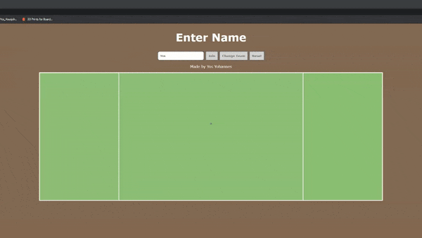

# UltiTool

This repo contains files to host a virtual ultimate frisbee field.

In index.js
```sh
4 const PORT = process.env.NODE_ENV == 'dev' ? 8000 : 8080;
```
Port 8000 and 8080 are used for development and production respectively. These can be changed

In  public/ulti.js
```sh
4 //var socket = io.connect('http://3.1.210.8:8080');
5 var socket = io.connect('http://localhost:8000');
```
Replace IP address (3.1.210.8) with your IPV4 address.
Uncomment line 4 when going live, comment off line 5
You can use line 5 when testing locally.

You can run with
```sh
$ npm run dev
```
OR
```sh
$ npm run prd
```

## Controls
WASD - movement

Mouse 1 - Throw. Distance direction and speed is based on mouse position.

Spacebar - "Drop" disc. This will reset stall count, hand pass to someone. Used by moving the otherway to drop disc on the spot.

Change team button will cycle between 2 teams. Team colour does not affect mechanics.

Reset will remove all players and place disc in starting position. To rejoin after a reset, REFRESH PAGE.

*DO NOT PLAY WITH THE SAME NAME*

## Testing

You can try it at http://3.1.210.8:8080/

This is hosted on Amazon EC2

